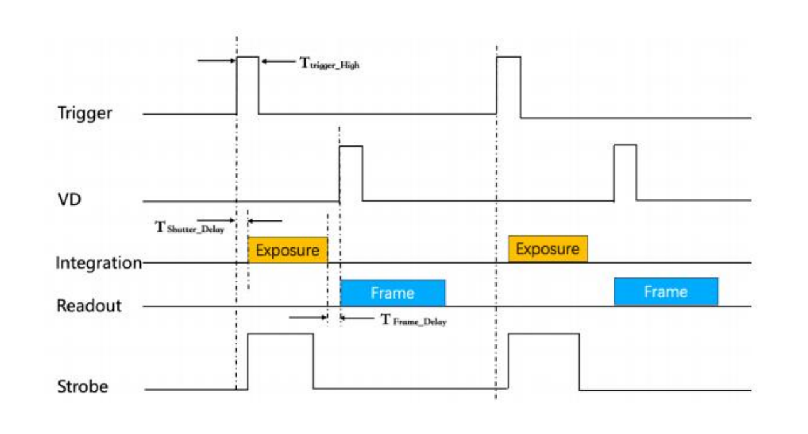
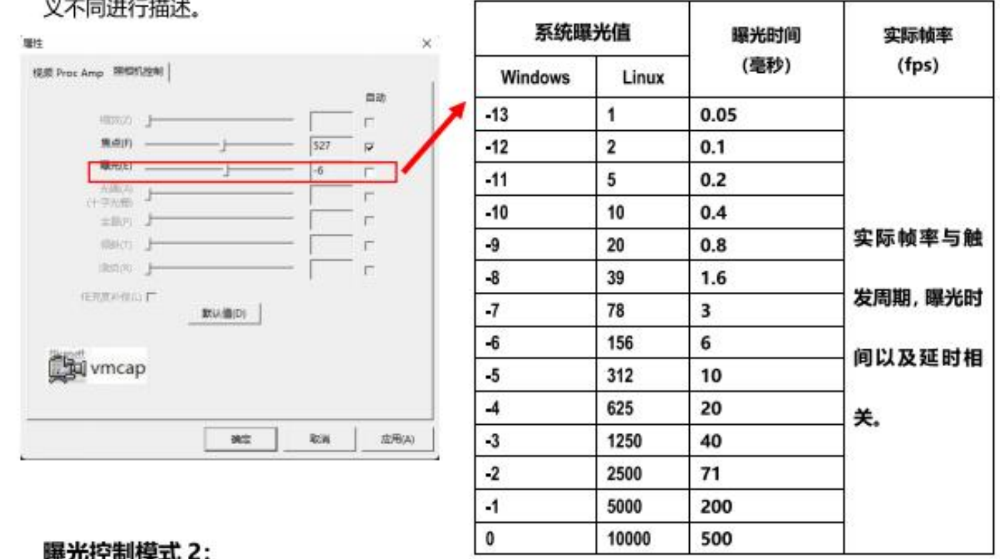
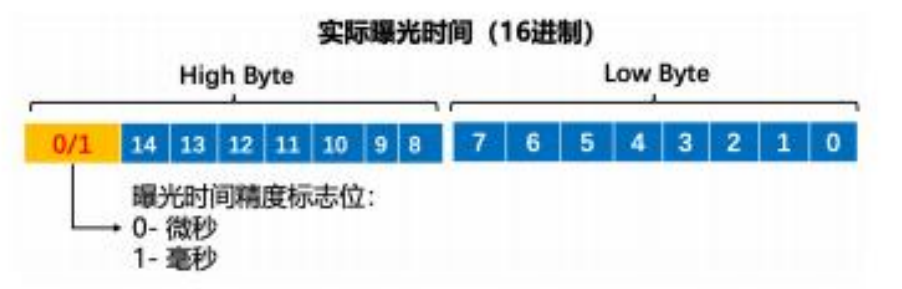
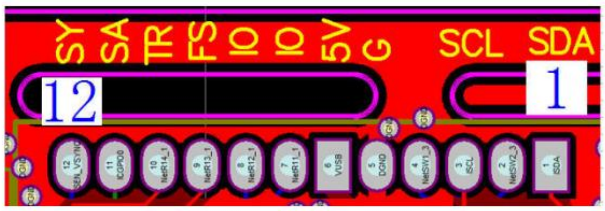

# UVC Camera Driver 

适配于UVC相机的RK3588-ROS驱动程序。

 - 该UVC相机具备一些私有协议，如下为该UVC相机的具体协议内容。

 - 使用前先将`udev`下的`99-usb-cam.rules`复制到`/etc/udev/rules.d/`文件夹下，并重新加载`udev`规则。

 - 依赖项安装：`sudo apt install libuvc-dev`

## 输出格式

| 分辨率         | 比例   | 帧率      |      | 
| ------------- | ------ | --------- | ---- | 
|               |        | YUV       | MJPG |
| 2592 x 1944   | 4 : 3  | 2.5 FPS   | 50 FPS |
| 2048 x 1536   | 4 : 3  | 2.5 FPS   | 50 FPS |
| 1600 x 1200   | 4 : 3  | 5 FPS     | 50 FPS |
| 1280 x 960    | 4 : 3  | 5 FPS     | 50 FPS |
| 1024 x 768    | 4 : 3  | 10 FPS    | 50 FPS |
| 960 x 720     | 4 : 3  | 15 FPS    | 50 FPS |
| 800 x 600     | 4 : 3  | 20 FPS    | 50 FPS |
| 640 x 480     | 4 : 3  | 30 FPS    | 50 FPS |
| 2560 x 1440   | 16 : 9 | 2.5 FPS   | 60 FPS |
| 2304 x 1296   | 16 : 9 | 2.5 FPS   | 60 FPS |
| 1920 x 1080   | 16 : 9 | 5 FPS     | 60 FPS |
| 1600 x 900    | 16 : 9 | 5 FPS     | 60 FPS |
| 1280 x 720    | 16 : 9 | 10 FPS    | 60 FPS |
| 1024 x 576    | 16 : 9 | 15 FPS    | 60 FPS |
| 960 x 540     | 16 : 9 | 15 FPS    | 60 FPS |
| 800 x 450     | 16 : 9 | 20 FPS    | 60 FPS |
| 640 x 360     | 16 : 9 | 30 FPS    | 60 FPS |
| 848 x 480     | 16 : 9 | 20 FPS    | 60 FPS |

## 参数说明

- 清晰度(Sharpness)∶先自动曝光关闭,支持直接写入实际曝光时间(微秒毫秒)
- 曝光(Exposure):自动/手动,手动曝光支持14阶预设曝光值设置
- 增益(Gain)︰先自动噪光关闭,支持Sensor增益设置
- 逆光对比(Backlight):视频流输出/软件连续触发/硬件触发设置/指令单触发/按键触发
- 色调 (Hue):软触发模式脉冲频率设置/指令单触发
- E-TZ: 数字缩放/水平移动/垂直移动(最大分辨率除外)
- 支持参数断电保存:参数断电保存功能,需遵循:设置参数->确定->关闭视频工具->重新打开工具或者拔插USB。参数设置完直接断电将不会保存数据。

|参数 | 值（范围） |  功能 |
| ---- | -----|-------|
|                    brightness 0x00980900 (int)    | min=-64 max=64 step=1 default=0 value=0  | 亮度 |
|                       contrast 0x00980901 (int)    | min=0 max=95 step=1 default=0 value=0  | 饱和度 |
|                   saturation 0x00980902 (int)    | min=0 max=255 step=1 default=58 value=58  | 对比度 |
|                            hue 0x00980903 (int)    | min=1 max=60 step=1 default=50 value=50  | 软触发模式脉冲频率设置/指令单触发 |
|        white_balance_automatic 0x0098090c (bool)   | default=1 value=1  | 自动白平衡 |
|                          gamma 0x00980910 (int)    | min=64 max=300 step=1 default=100 value=100  | gamma |
|                           gain 0x00980913 (int)    | min=1 max=240 step=1 default=100 value=100  | 先自动噪光关闭,支持Sensor增益设置 |
|           power_line_frequency 0x00980918 (menu)   | min=0 max=2 default=1 value=1  |  |
|                           |     0: Disabled  |  |
|                           |     1: 50 Hz  |  |
|                           |     2: 60 Hz  |  |
|      white_balance_temperature 0x0098091a (int)    | min=2800 max=6500 step=1 default=4600 value=4600 flags=inactive  | 白平衡色温 |
|                      sharpness 0x0098091b (int)    | min=1 max=33768 step=1 default=2000 value=2000 | 先自动曝光关闭,支持直接写入实际曝光时间(微秒毫秒) |
|         backlight_compensation 0x0098091c (int)    | min=0 max=4 step=1 default=0 value=0 | 视频流输出/软件连续触发/硬件触发设置/指令单触发/按键触发 |
|                  auto_exposure 0x009a0901 (menu)  | min=0 max=3 default=3 value=3 | 自动曝光 |
|                             |   1: Manual Mode  |  |
|                             |   3: Aperture Priority Mode  | |
|         exposure_time_absolute 0x009a0902 (int)    | min=1 max=10000 step=1 default=78 value=5999 flags=inactive |  |
|                   pan_absolute 0x009a0908 (int)    | min=-648000 max=648000 step=3600 default=0 value=0 | |
|                  tilt_absolute 0x009a0909 (int)    | min=-648000 max=648000 step=3600 default=0 value=0 | |
|                 focus_absolute 0x009a090a (int)    | min=0 max=1023 step=1 default=0 value=339 flags=inactive | |
|     focus_automatic_continuous 0x009a090c (bool)   | default=1 value=1 | |
|                  zoom_absolute 0x009a090d (int)    | min=0 max=60 step=1 default=0 value=0 | |

## 触发模式

说明:使用触发模式,需先配置UVC PU `逆光对比(Backlight)`参数。注意软件触发模式和硬件触发模式不能同时使用。

- 逆光对比值为 `0` : 非触发模式,视频流自动以最高率输出;
- 逆光对比值为 `1` : 软件触发,第三方软件通过UVC PU 控制接口的`色调(Hue)`参数进行触发脉冲频率配置,脉冲频率范围1Hz-60Hz。按照设置触发频率连续输出帧。
- 逆光对比值为 `2` : 硬件触发模式,由外部提供触发脉冲信号。
- 逆光对比值为 `3` : 指令触发,第三方软件通过 UVC PU 控制接口的`色调(Hue)`参数进行,固定指令(十进制100)控制单触发。发一次100,触发一帧。无指令,不输出。
- 逆光对比值为 `4` : 按键触发,上升沿触发,按键一次,输出一帧。

## 外部触发时序

1. 触发脉宽 $T_{trigger\_High}$ : 最小值3ms。
2. 曝光延时 $T_{shutter\_Delay}$ : 1.760ms.
3. 帧输出延时 $T_{frame\_Delay}$ : 0.067ms 
4. Strobe闪光灯信号由Sensor输出,有效时间取决于曝光时间。
5. Exposure(曝光时间)需手动配置,请参考曝光控制说明。曝光完成即输出开始。

## 曝光控制

### 曝光控制模式1

自动曝光关闭,曝光时间可通过UVC `曝光`选项配置,如下列出 UVC windows 系统标准14阶曝光预设值所对应的实际曝光时间。同时针对 Linux 系统UVC 曝光参数值和范围的定义不同进行描述。

### 曝光控制模式2

自动喙光关闭,使用UVC `清晰度`选项,第三方软件可通过该接口直接写入实际光时间,传入曝光值格式需遵循如下定义:

说明:触发模式下,(曝光时间+帧时间+曝光延时+延时)超过触发周期,则实际率至少降低到一半。如果需要保持帧率,(曝光时间+帧时间+曝光延时+延时)要小于等于触发周期,这时需要降低曝光时间。

## 增益控制

说明:自动曝光关闭,Sensor增益可通过 UVC `增益`选项配置,预设值范围已经是Sensor支持的增益范围,增益越大,图像噪点越大

## 硬件规格

PCB 端子 PIN 脚丝印定义如下

| Pin NO. | 定义          | 状态   | 说明                                  |
| ------- | ------------- | ------ | ------------------------------------- |
| PIN1    | 预留          | SDA    | 3.3V 基准                            |
| PIN2    | 预留          | 悬空   | 无                                  |
| PIN3    | 预留          | SCL    | 3.3V 基准                            |
| PIN4    | 预留          | 悬空   | 无                                  |
| PIN5    | GND           |        | 地                                  |
| PIN6    | 5V            |        | USB 电源 5V 基准                       |
| PIN7    | 预留          | GPIO   | 3.3V 基准                            |
| PIN8    | 预留          | GPIO   | 3.3V 基准                            |
| PIN9    | FINS          | 输入   | Trigger, 硬件出发出输入, 1.8V 基准 |
| PIN10   | Strobe/Flash | 输出   | 外接闪光灯信号输出, 1.8V 基准           |
| PIN11   | 预留          | GPIO   | 1.8V 基准                            |
| PIN12   | 预留          | GPIO   | 1.8V 基准                            |

说明
- 外部触发输入硬件连接: 连接9PIN（Trgeer）和5PIN(GND)
- 散光灯信号输出硬件连接: 连接10PIN(Strobe/Flash)和 5PN（GND）

